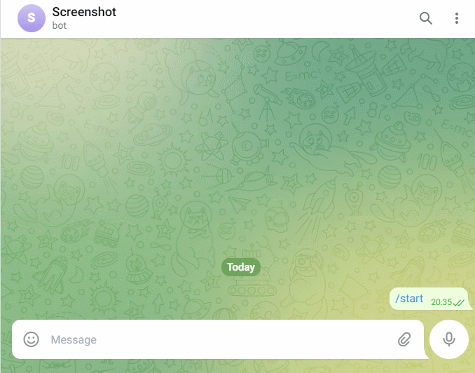

# Screenshot telegram bot

# Description
[You can easily take screenshot of link. Also this screenshot save at directory "screens"](#anchor)
---

# Installation Guide
> Setup
*** 
    $ git clone //github.com/Vitaly182/bot.git
    $ cd bot

> Docker
***
    $ docker-compose up

> Create and activate virtual environment.
***
    $ pip3 install virtualenv
    $ virtualenv venv
    $ source venv/bin/activate

> Install dependencies.
***
    $ pip3 install -U -r requirements.txt